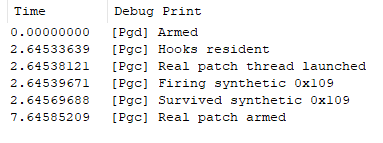
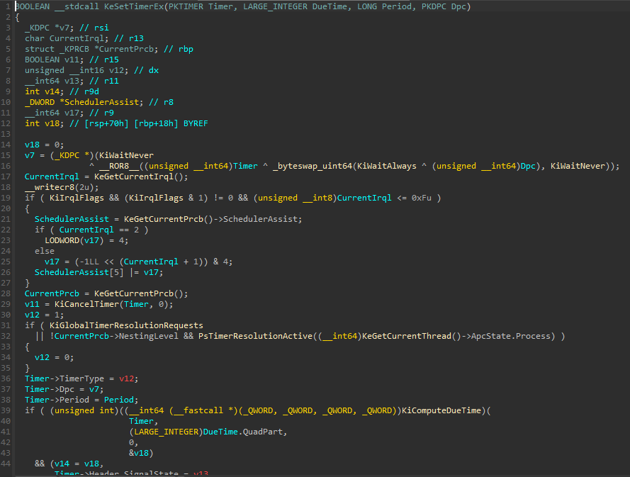
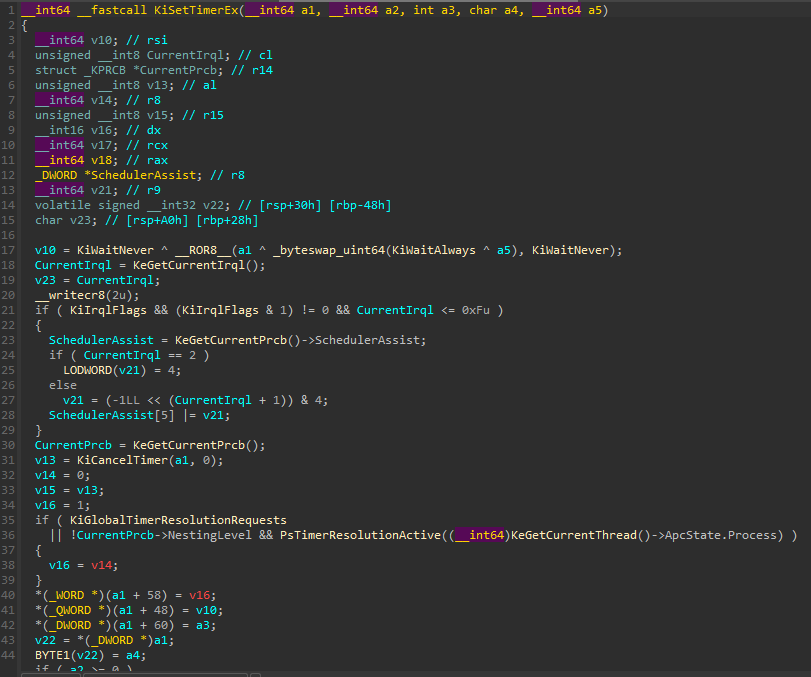
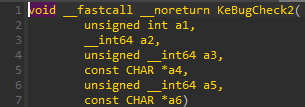

# patchguard-disabler - HalPrivateDispatchTable PatchGuard disabler

i wanted to see if PatchGuard could be disabled from inside the kernel by intercepting the bugcheck path. so i built patchguard-disabler, a Windows kernel driver. `PgDisabler.sys` hooks `HalPrepareForBugcheck` / `HalNotifyProcessorFreeze` in `HalPrivateDispatchTable` and swallows `0x109` bugchecks by restoring a trapped context, and `PgCanary.sys` proves it with a synthetic `0x109` and a real HalDispatchTable patch that causes PatchGuard to fire.

to be clear: this is a poc that grew into a small project, not a maintained PG bypass. it was built and tested on one build only, 23H2 (`ntoskrnl.exe` 22631.7219). it may work on other winvers since every offset is resolved dynamically instead of hardcoded. everything below is stuff i verified on 23H2.

## what is this?

- **PgDisabler** - resolves `HalPrivateDispatchTable`, `KiBugCheckActive`, `KiHardwareTrigger`, PRCB `IpiFrozen`/`Context`/`DebuggerSavedIRQL` offsets by scanning `KeBugCheckEx`/`KeBugCheck2`, then swaps the table's `PrepareForBugcheck` (`+0x108`) and `NotifyProcessorFreeze` (`+0x1A8`) slots via physical mapping. on a `0x109` it zeroes the active/trigger flags, parks `IpiFrozen`, and `RtlRestoreContext`s back to a trapped usermode-ish context instead of dying
- **PgCanary** - the test harness. checks both hooks are resident (target outside `ntoskrnl` = hooked), fires a synthetic `0x109` with a planted `CONTEXT` on its own stack, and separately swaps `HalDispatchTable[1]<->[2]` for 8 minutes

features:
- **scan-not-hardcode resolve** - `KeBugCheckEx` opcode shapes (`48/49 8B ... E8` for the PRCB context slot, `65 88 04` for the gs IRQL byte, `F0 FF 05` for the hardware trigger, `E8`-into-`F0 0F B1` for `KeBugCheck2` into `KiBugCheckActive`), spin/`pause`-search for the `IpiFrozen` shape, `HalPrivateDispatchTable` export + version gate (`6..0x100`)
- **physical writes** - table slots go through `MmGetPhysicalAddress` + `MmMapIoSpaceEx`, so read-only HAL pages don't matter, with readback verify and restore-on-unload
- **HIGH_LEVEL-safe swallow** - everything the hook touches at bugcheck IRQL is prove-mapped-first (`MmIsAddressValid` PTE walks, no SEH reliance, SEH can't catch faults there anyway), single `DbgPrint` on arm and nothing else

## screenshots



*full pass on 23H2: disabler armed, canary sees both hooks resident, real-patch thread launched, synthetic `0x109` fired and survived, real patch armed after its 5s delay*



*IDA decompiler on `KeSetTimerEx`: `v7 = KiWaitNever ^ ROR(Timer ^ bswap(KiWaitAlways ^ Dpc), KiWaitNever)` - the cipher the timer-decrypt work inverts*



*IDA decompiler on `KiSetTimerEx`: same opcode pair on the shadow path (`v10 = KiWaitNever ^ ROR(a1 ^ bswap(KiWaitAlways ^ a5), KiWaitNever)`)*



*IDA decompiler on `KeBugCheck2` - the function the resolver's `E8`-scan lands in to find `KiBugCheckActive` and the freeze spin*

## how it works

1. **load** - `DriverEntry` finds `ntoskrnl` base/size off `PsLoadedModuleList`, runs the resolver, version-checks the HAL table, installs both hooks with readback verify. any failure returns `STATUS_UNSUCCESSFUL` with zero hooks left behind
2. **resolve** - `KeBugCheckEx` is the core: one scan each for the context slot, the gs IRQL byte, the hardware trigger, and the call into `KeBugCheck2`. inside `KeBugCheck2` the `pause; jmp` spin is hunted to derive the `IpiFrozen` PRCB offset (three shape variants and a displacement fallback)
3. **hook** - `HalHook::Install` saves both originals, writes `HookHandler::Prepare` / `NotifyFreeze` through the physical mapping, reads both slots back, reverts everything on mismatch
4. **swallow** - every `PrepareForBugcheck` call reads the trapped `CONTEXT` out of the PRCB and checks `Rcx`. non-`0x109` falls straight through to the original. on `0x109`: clear active + trigger, set `IpiFrozen = 5`, spoof the PCR major version around the critical section, stash the saved IRQL, raise to `DISPATCH` (IF set) or `HIGH` (IF clear), scan the stack for the planted `CONTEXT` fingerprint (`0x10005F`/`0x10001F`, `Cs == 0x10`, user segments), and `RtlRestoreContext` into it
5. **canary** - `CheckHooks` reports residency, `StartRealPatch` swaps the HAL slots on a 5s-delayed thread and restores after 8 minutes, `FireSynthetic` plants a `CONTEXT` locally and calls `KeBugCheckEx(0x109, ...)`. surviving prints `Survived synthetic 0x109`
6. **unload** - `DriverLifecycle::Unload` physically writes both originals back.

## project structure

```
patchguard-disabler/
├── CMakeLists.txt               # root project, ASM_MASM enabled for the cli/sti/cr8 shim
├── build.bat                    # vswhere + ml64 PATH, Ninja + clang-cl, intermediate/ dir
├── images/                      # screenshots
├── include/Driver/
│   ├── Core/Core.h              # NtRange, DriverLifecycle
│   ├── Hook/Hook.h              # PhysMem, Probe, HookHandler, HalHook, Swallow (+ PgCli/Sti decls)
│   ├── Nt/NtTypes.h             # KLDR_DATA_TABLE_ENTRY
│   └── Resolve/Resolve.h        # HalTable, BugcheckAnchors, ProcessorLayout, Resolver
├── include/Canary/
│   ├── Core/Core.h              # NtRange, DriverLifecycle
│   └── Test/Test.h              # CanaryTest
├── src/Driver/
│   ├── CMakeLists.txt           # PgDisabler.sys, WDM, /kernel, /GS-, sign + copy to build/
│   ├── Core/DriverEntry.cpp     # load: range, resolve, version gate, install
│   ├── Core/DriverUnload.cpp    # restore both slots
│   ├── Core/NtRangeInit.cpp     # ntoskrnl base/size via PsLoadedModuleList
│   ├── Resolve/RangeContains.cpp
│   ├── Resolve/SystemExport.cpp
│   ├── Resolve/ResolveAll.cpp   # the five scans + spin hunt + table gate
│   ├── Hook/PhysWrite.cpp       # physical pointer write
│   ├── Hook/ProbeRange.cpp      # prove-mapped helper for HIGH_LEVEL touches
│   ├── Hook/HookInstall.cpp     # save, write, readback-verify
│   ├── Hook/HookRemove.cpp      # restore originals
│   ├── Hook/HookPrepare.cpp     # try-swallow else fall through
│   ├── Hook/HookFreeze.cpp      # pure passthrough
│   ├── Hook/SwallowTry.cpp      # guarded 0x109 swallow
│   ├── Hook/SwallowFind.cpp     # stack scan for the planted CONTEXT
│   ├── Hook/SwallowContinue.cpp # cli, writecr8, RtlRestoreContext
│   └── Hook/SwallowAsm.asm      # PgCli/PgSti/PgWriteCr8/PgWriteGsByte (ml64)
└── src/Canary/
    ├── CMakeLists.txt           # PgCanary.sys, same flags
    ├── Core/DriverEntry.cpp     # residency check, thread start, synthetic fire
    ├── Core/DriverUnload.cpp
    ├── Core/NtRangeInit.cpp
    └── Test/                    # ExportQuery, InsideNt, HooksCheck, SyntheticFire,
                                 # PhysWrite, RealPatchThread, RealPatchStart
```

## prerequisites

- **Windows x64 test VM only** (this disables PatchGuard on purpose, HVCI/VBS off)
- **23H2 for a working run** (`ntoskrnl` 22631.7219 verified, other winvers untested and the scans may or may not work)
- **WDK 10** (`10.0.28000.0`, for `km` headers + `ntoskrnl`/`hal` libs)
- **LLVM with clang-cl** (Ninja only) plus **CMake** (3.20+) and **Ninja**

## building

```cmd
build.bat
```

`build.bat Release` (default) configures `intermediate/` with Ninja + clang-cl and builds `build/PgDisabler.sys` and `build/PgCanary.sys`, each test-signed after copy.

## usage

load the disabler first, then the canary (mapper, in that order). expected DbgView sequence on 23H2:

```
[Pgd] Armed
[Pgc] Hooks resident
[Pgc] Real patch thread launched
[Pgc] Firing synthetic 0x109
[Pgc] Survived synthetic 0x109
[Pgc] Real patch armed
```

then wait: the real-patch thread restores `HalDispatchTable` after 8 minutes (`Real patch restored`).

## notes

- the hook runs at `HIGH_LEVEL` where `__try` catches nothing, so every touch there is validated with PTE reads first and the scan stops at the first unmapped probe instead of faulting
- `Probe::RangeMapped` checks first and last byte of a range. a `CONTEXT` fits in two pages max, so both PTEs covered means the reads are safe

## limitations

- **23H2-only verified.** the resolver is pattern-based so it has a chance on other winvers, but shapes change between builds and a missed scan fails the load instead of guessing
- **a wrong-but-plausible scan is still possible.** bounds checks (`< 0x20000` PRCB-relative, version range, readback verify) catch garbage, but a small wrong offset that stays mapped would swallow the wrong state. the `Survived` line is the only real proof per machine
- **no SMP freeze handling.** `NotifyFreeze` is passthrough and `IpiFrozen = 5` is best-effort (skipped when the shape scan misses). a real multi-CPU `0x109` may still die on another processor's path

## what i learned

- the bugcheck path runs at `HIGH_LEVEL` and that single fact dictates the whole hook design: no locks, no pageable touches, no SEH reliance, validate-then-touch or die
- the canary is the project, not the accessory: without the synthetic fire plus the 8-minute real dare there is no observable difference between "PG disabled" and "nothing happened yet"
